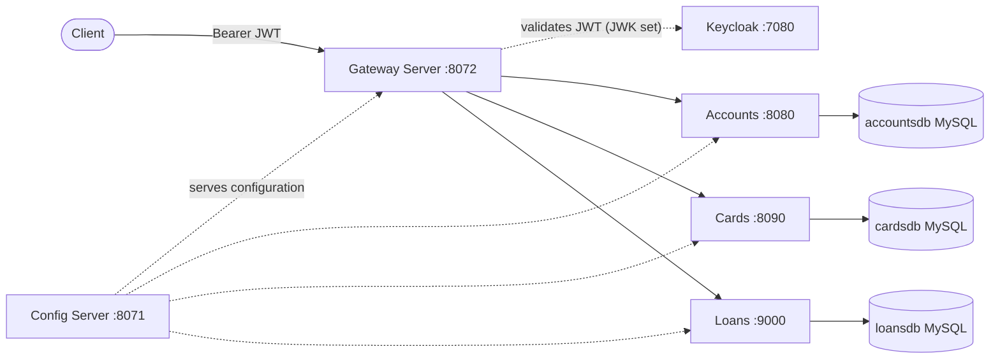

# 🏦 CelikBank Microservices

A scalable banking system built with **Spring Boot 4.0+** and **Spring Cloud**, packaged with **Docker** and deployed on **Kubernetes** using **Helm**. Each business domain is an independent microservice with its own database, secured end-to-end with **Keycloak (OAuth2 / JWT)**.

## 📑 Table of Contents

- [Features](#-features)
- [Tech Stack](#️-tech-stack)
- [Architecture](#️-architecture)
- [Services](#-services)
- [Security & Authentication](#-security--authentication)
- [Getting Started](#-getting-started)
- [Sample API Request](#-sample-api-request)
- [Configuration Notes](#️-configuration-notes)
- [Author](#-author)

## ✨ Features

- **Database-per-service**: `accounts`, `cards` and `loans` each own a dedicated MySQL database, so services can be developed, scaled and deployed independently.
- **Centralized configuration**: all services pull their YAML configuration from a Spring Cloud Config Server, with environment-specific profiles (e.g. `prod`).
- **Single entry point**: every external request goes through the Spring Cloud Gateway, which validates the JWT and routes traffic to the right service.
- **Token-based security**: Keycloak issues the tokens; the gateway verifies them against Keycloak's JWK set.
- **Resilience**: Circuit Breaker, Rate Limiter and Retry via Resilience4j.
- **Kubernetes-native**: service discovery and load balancing through Kubernetes, configuration shared via a ConfigMap.

## 🛠️ Tech Stack

| Area                       | Technologies                                        |
| -------------------------- | --------------------------------------------------- |
| Backend                    | Java, Spring Boot, Spring Cloud (Gateway, Config)   |
| Database & Cache           | MySQL 8.0, Redis                                    |
| Security                   | Keycloak (OAuth2 / JWT)                             |
| Discovery & Load Balancing | Kubernetes native discovery, Spring Cloud Gateway   |
| Resilience                 | Resilience4j (Circuit Breaker, Rate Limiter, Retry) |
| DevOps & Deployment        | Docker, Kubernetes, Helm, Jib                       |

## 🏗️ Architecture



## 📦 Services

The system is made of the following independently scalable services:

| Service            | Port | Responsibility                                                                                                   |
| ------------------ | ---- | ---------------------------------------------------------------------------------------------------------------- |
| **Config Server**  | 8071 | Centrally manages the configuration (YAML) files of all microservices.                                           |
| **Gateway Server** | 8072 | Receives external requests, validates the Keycloak token and routes traffic to internal services via Kubernetes. |
| **Accounts**       | 8080 | Manages customer profiles and bank account details.                                                              |
| **Cards**          | 8090 | Handles credit card creation, updates and limit management.                                                      |
| **Loans**          | 9000 | Manages loan applications, details and payment schedules.                                                        |
| **Keycloak**       | 7080 | Identity and access management (OAuth2 / JWT issuer).                                                            |

Each business service (Accounts, Cards, Loans) talks to its own MySQL instance (`accountsdb`, `cardsdb`, `loansdb`).

## 🔒 Security & Authentication

All API endpoints are secured with JWT-based OAuth2 through **Keycloak**. The gateway acts as an OAuth2 resource server and verifies tokens against Keycloak's public keys.

To open the Keycloak admin console locally, forward the port:

```bash
kubectl port-forward svc/keycloak 7080:80
```

Admin console: <http://localhost:7080>

> If you are running on Docker Desktop, the `LoadBalancer` service is usually reachable at `localhost:7080` without port-forwarding.

## 🚀 Getting Started

Run the project on a local Kubernetes cluster (Docker Desktop, Minikube, etc.).

### Prerequisites

- Java 25+ and Maven
- Docker
- A local Kubernetes cluster and `kubectl`
- Helm

### 1. Build the Docker images (Jib)

Run the following in each microservice directory. It builds the image and loads it straight into your local Docker daemon, no Dockerfile needed:

```bash
mvn clean compile jib:dockerBuild
```

> Prebuilt images are also published under `rafettcelikk/<service>:s17`.

### 2. Deploy to Kubernetes (via Helm)

Since this project uses Helm for infrastructure management, you can deploy the entire stack with a single command. Navigate to the directory containing your Helm chart and run:

```bash
helm install celikbank ./helm
```

_(Adjust the `./helm` path if your chart is located in a specific sub-folder.)_

### 3. Verify the deployment

Make sure every pod is in the `Running` state:

```bash
kubectl get pods
```

## 💡 Sample API Request

External access is only allowed through the **API Gateway (port 8072)**. Obtain a valid Bearer token from Keycloak before calling any endpoint.

**Create an account (Accounts service):**

```http
POST http://localhost:8072/celikbank/accounts/api/create?mobileNumber=1234567890
Authorization: Bearer <access_token>
```

## ⚙️ Configuration Notes

Shared settings live in a single ConfigMap (`celikbank-configmap`): active Spring profile, Config Server address and Keycloak's JWK set URI.

> ⚠️ The credentials in the Helm values (`root/root` for MySQL, `user/password` for Keycloak) are **development-only defaults**. For any real deployment, move them into Kubernetes Secrets and run Keycloak in production mode instead of `start-dev`.

## 👤 Author

**Rafet Çelik** | Full-Stack Java Developer (React & Spring Boot)

GitHub: [@rafettcelikk](https://github.com/rafettcelikk)
